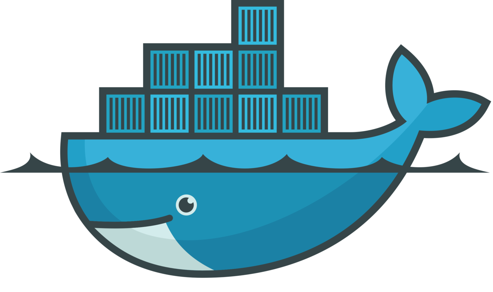
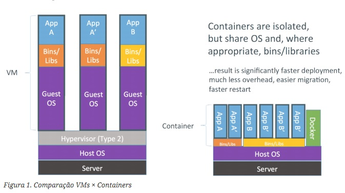
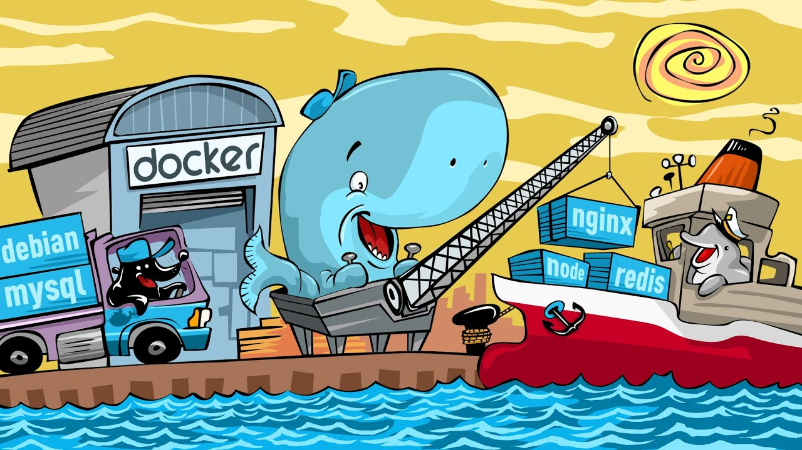

<h1 align="center">
    
     📚 🐳 Curso de Docker 🐳 📚 
</h1>

	🎉 🎉

# 📑 Tópicos

    &nbsp;&nbsp;&nbsp;|&nbsp;&nbsp;&nbsp;<a href="#-sobre-o-docker">🐳 Sobre o Docker</a>&nbsp;&nbsp;&nbsp;|&nbsp;&nbsp;&nbsp;<a href="#-sobre-o-curso">📖 Sobre o curso</a>&nbsp;&nbsp;&nbsp;|&nbsp;&nbsp;&nbsp;<a href="#-o-que-aprendemos">💡 O que aprendemos</a>&nbsp;&nbsp;&nbsp;|&nbsp;&nbsp;&nbsp;

	|&nbsp;&nbsp;&nbsp;<a href="#-projetos">🏗 Projetos</a>&nbsp;&nbsp;&nbsp;|&nbsp;&nbsp;&nbsp;<a href="#-material-de-apoio">📚 Material de apoio</a>&nbsp;&nbsp;&nbsp;|&nbsp;&nbsp;&nbsp;<a href="#-licen%C3%A7a">📜 Licença</a>&nbsp;&nbsp;&nbsp;|&nbsp;&nbsp;&nbsp;

	|&nbsp;&nbsp;&nbsp;<a href="#-certificado">🎓 Certificado de conclusão</a>&nbsp;&nbsp;&nbsp;|

<h3 align="center">
    <a href="https://www.cod3r.com.br/courses/docker" > COD3R.COM.BR </a>
</h3>

## 🐳 Sobre o Docker

<a href="#----------curso-de-docker--">⤴ Voltar</a> 
Docker é um conjunto de produtos de plataforma como serviço (<strong>PaaS - Platform as a Service</strong>) que usam virtualização a nível de sistema operacional para entregar software em pacotes chamados contêineres. Os contêineres são isolados uns dos outros e agrupam seus próprios softwares, bibliotecas e arquivos de configuração. Eles podem se comunicar uns com os outros por meio de canais bem definidos. Todos os contêineres são executados por um único kernel do sistema operacional e, portanto, usam menos recursos do que as máquinas virtuais.

<h1 align="center"> 
    
</h1>

**->** Contêineres são isolados, porém compartilham o Sistema Operacional Hospedeiro e, quando for apropriado, Arquivos biários e Bibliotecas. Como resultado tem um significante ganho de tempo na implementação (Deployment), muito menos sobrecarga, migração mais fácil e reinicialização mais rápida.

## 📖 Sobre o curso

<a href="#----------curso-de-docker--">⤴ Voltar</a> 
Lembra aquela frase: “Só sei que funciona na minha máquina”? O velho e bom selo de qualidade "Works On My Machine"? Pois bem, seja bem vindo ao Curso que vai acabar com essa desculpa!

Detalhando um pouco mais sobre o Docker, ele tem como tarefa central manipular os "containers". Ainda vou conceituar o que é container, mas a ideia é que o seu software possa ser executado em um ambiente isolado e que fique blindado o máximo possível de interferências externas. Rapidamente você perceberá que uma classe inteira de bugs será eliminada pela padronização entre o ambiente de desenvolvimento e o ambiente produtivo que o software será executado.

Outra vantagem incrível é a facilidade de replicar um ambiente Dockerizado para dezenas/centenas de desenvolvedores. Esqueça as longas horas para configurar o seu sistema na máquina de um novo dev, Isso sem dúvida será coisa do passado.

No curso você aprenderá os principais conceitos do Docker com vários exercícios práticos, todos descritos detalhadamente na apostila que será disponibilizada no curso. Tudo que for ministrado no curso estará disponível na apostila, e ter esse suporte a mais, será um diferencial fantástico.

Para finalizar, quero convidar você que é desenvolvedor, DevOps, para nos acompanhar nessa caminhada com o Docker, não tenho dúvida que o nível que profissionalismo dos seus ambientes será outro depois das aulas.

## 💡 O que aprendemos

<a href="#----------curso-de-docker--">⤴ Voltar</a> 
* ✔ Utilizar containers para simplificar seus processos
* ✔ Publicar suas imagens em ambientes na nuvem, seja para distribuição ou execução dos serviços
* ✔ Utilizar ferramentas diversas de integração contínua baseado em containers
* ✔ Criar imagens com seus produtos
* ✔ Gerenciar conjuntos de micro serviços

   #### 🗒 Etapas

<ul>
	<li>[x] 1. Introdução
		<ul>
			<li>[x] 1.1. Visão Geral</li>
			<li>[x] 1.2. Apresentação - Juracy Filho</li>
			<li>[x] 1.3. Apresentação - Leonardo Leitão</li>
			<li>[x] 1.4. Material de Apoio: Repositório e Apostila</li>
			<li>[x] 1.5. Apostila Docker</li>
			<li>[x] 1.6. Suporte - Boas Práticas</li>
		</ul>
	</li>
	<li>[x] 2. Conceitos
		<ul>
			<li>[x] 2.1. O que é Docker?</li>
			<li>[x] 2.2. Por que não uma VM?</li>
			<li>[x] 2.3. O que são containers?</li>
			<li>[x] 2.4. O que são imagens Docker?</li>
			<li>[x] 2.5. Imagem vs Container</li>
			<li>[x] 2.6. Arquitetura</li>
		</ul>
	</li>
	<li>[x] 3. Instalação
		<ul>
			<li>[x] 3.1. Instalação - Visão Geral</li>
			<li>[x] 3.2. Instalação Windows</li>
			<li>[x] 3.3. Instalação Mac</li>
			<li>[x] 3.4. Instalação Linux</li>
		</ul>
	</li>
	<li>[x] 4. Uso básico do Docker
		<ul>
			<li>[x] 4.1. Introdução ao Docker Client</li>
			<li>[x] 4.2. Hello World: Meu Docker funciona!</li>
			<li>[x] 4.3. Meu querido amigo run</li>
			<li>[x] 4.4. Ferramentas diferentes</li>
			<li>[x] 4.5. Run cria sempre novos containers</li>
			<li>[x] 4.6. Containers devem ter nomes únicos</li>
			<li>[x] 4.7. Reutilizar containers</li>
			<li>[x] 4.8. Cego, surdo e mudo, só que não!</li>
			<li>[x] 4.9. Mapear portas dos containers</li>
			<li>[x] 4.10. Mapear diretórios para o container</li>
			<li>[x] 4.11. Rodar um servidor web em background</li>
			<li>[x] 4.12. Gerenciar o container em background</li>
			<li>[x] 4.13. Manipulação de containers em modo daemon</li>
			<li>[x] 4.14. Nova sintaxe do Docker Client</li>
		</ul>
	</li>
	<li>[x] 5. Deixando de ser apenas um usuário
		<ul>
			<li>[x] 5.1. Introdução</li>
			<li>[x] 5.2. Diferenças entre container e imagem</li>
			<li>[x] 5.3. Entendendo melhor as imagens</li>
			<li>[x] 5.4. Comandos básicos no gerenciamento de imagens</li>
			<li>[x] 5.5. Docker Hub × Docker Registry</li>
			<li>[x] 5.6. Meu primeiro build</li>
			<li>[x] 5.7. Uso das instruções de preparação</li>
			<li>[x] 5.8. Uso das instruções de povoamento</li>
			<li>[x] 5.9. Uso das instruções para execução do container (Parte 1)</li>
			<li>[x] 5.10. Uso das instruções para execução do container (Parte 2)</li>
			<li>[x] 5.11. Enviar Imagens para o Docker Hub</li>
		</ul>
	</li>
	<li>[x] 6. Redes
		<ul>
			<li>[x] 6.1. Visão Geral e Tipos de Redes</li>
			<li>[x] 6.2. Rede Tipo None (Sem Rede)</li>
			<li>[x] 6.3. Rede Tipo Bridge</li>
			<li>[x] 6.4. Rede Tipo Host</li>
		</ul>
	</li>
	<li>[x] 7. Coordenando múltiplos containers
		<ul>
			<li>[x] 7.1. Introdução</li>
			<li>[x] 7.2. Gerenciamento de micro service</li>
		</ul>
	</li>
	<li>[x] 8. Projeto cadastro simples (CRUD)
		<ul>
			<li>[x] 8.1. Estrutura Inicial</li>
			<li>[x] 8.2. Configurando Ambiente com Compose</li>
			<li>[x] 8.3. Finalizando o Cadastro</li>
		</ul>
	</li>
	<li>[x] 9. Projeto de envio de emails com Workers
		<ul>
			<li>[x] 9.1. Visão Geral</li>
			<li>[x] 9.2. Banco de dados</li>
			<li>[x] 9.3. Volumes</li>
			<li>[x] 9.4. Front-end</li>
			<li>[x] 9.5. Filas</li>
			<li>[x] 9.6. Proxy reverso</li>
			<li>[x] 9.7. Redes</li>
			<li>[x] 9.8. Workers</li>
			<li>[x] 9.9. Múltiplas instâncias</li>
			<li>[x] 9.10. Boas práticas - Variáveis de ambiente</li>
			<li>[x] 9.11. Override</li>
		</ul>
	</li>
</ul>
    

    

## 🎓 Certificado

<a href="#----------curso-de-docker--">⤴ Voltar</a> 
#### Em andamento...

## 🏗 Projetos

<a href="#----------curso-de-docker--">⤴ Voltar</a> 
1. ✔ Repositório -> [CRUD](https://github.com/WernerLuiz92/CRUD-Docker) <- Concluído
2. 🛠 Repositório -> [E-mails com Workers](https://github.com/WernerLuiz92/Emails-Docker) <- Em Andamento

## 📚 Material de apoio

<a href="#----------curso-de-docker--">⤴ Voltar</a> 
#### 📔 Apostila
[PDF](docs/apostila-docker.pdf)

#### 📂 Repositório
[GitHub](https://github.com/cod3rcursos/curso-docker)

## 📜 Licença

<a href="#----------curso-de-docker--">⤴ Voltar</a> 
Este repositório e seus exercícios, documentos e anotações estão sob a licença MIT. Veja o arquivo [LICENSE](LICENSE) para mais detalhes. 

**O conteúdo do curso (Imagens, Apostila, Repositório) estão sob licença da COD3R.COM.BR para mais detalhes entre em contato em [COD3R](https://www.cod3r.com.br/)

---

Projeto desenvolvido com a tutoria de [Juracy Filho e Leonardo leitão](https://www.cod3r.com.br/courses/docker), na [COD3R](https://www.cod3r.com.br/).
